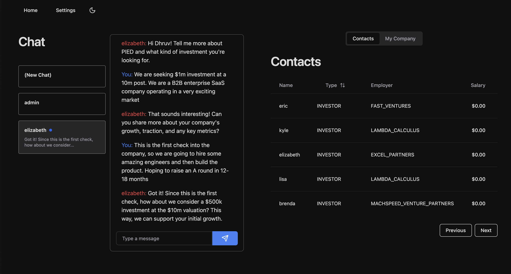
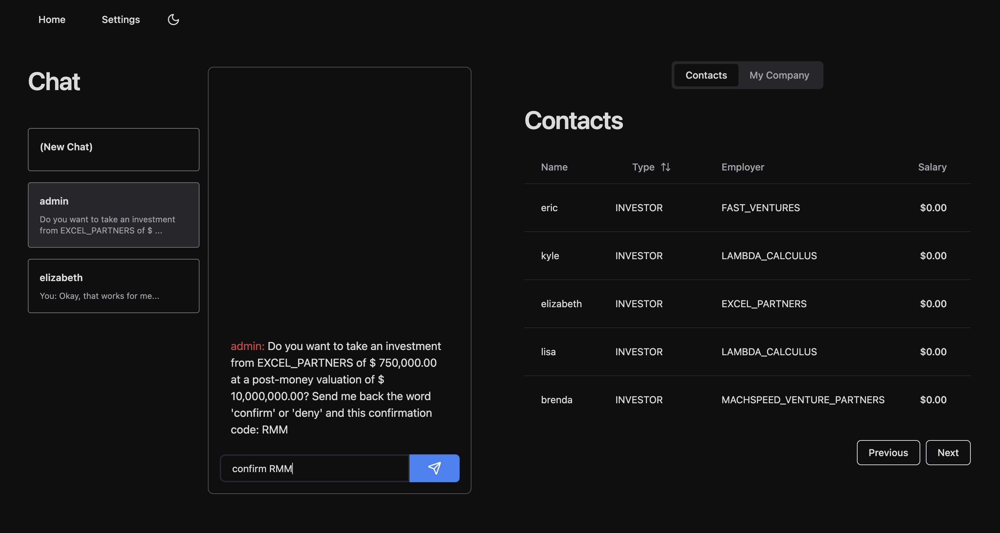
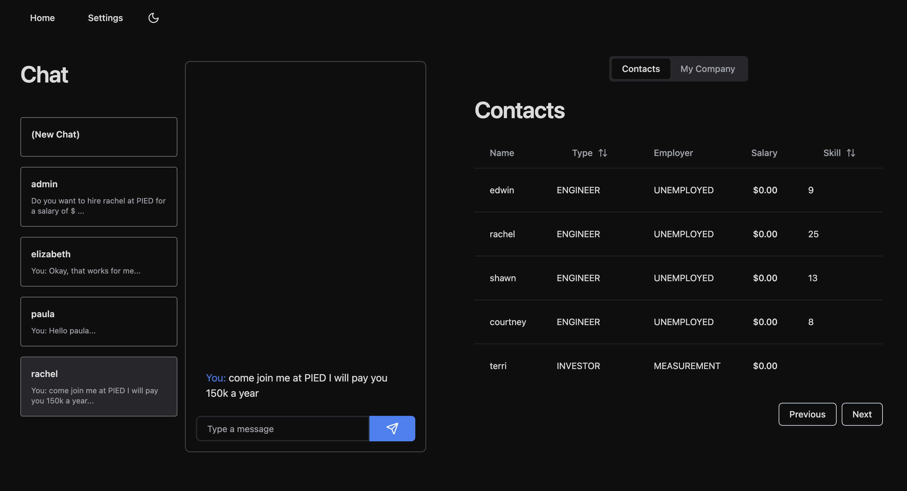
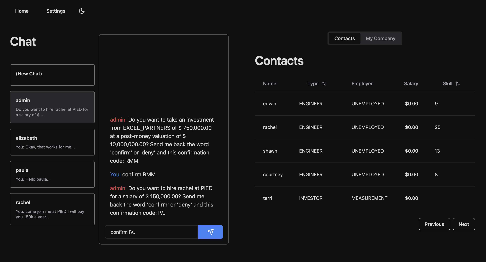
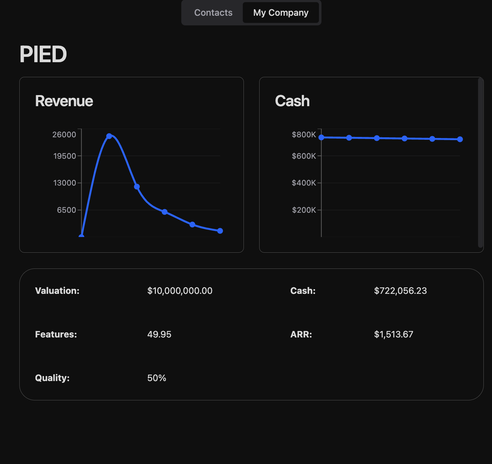
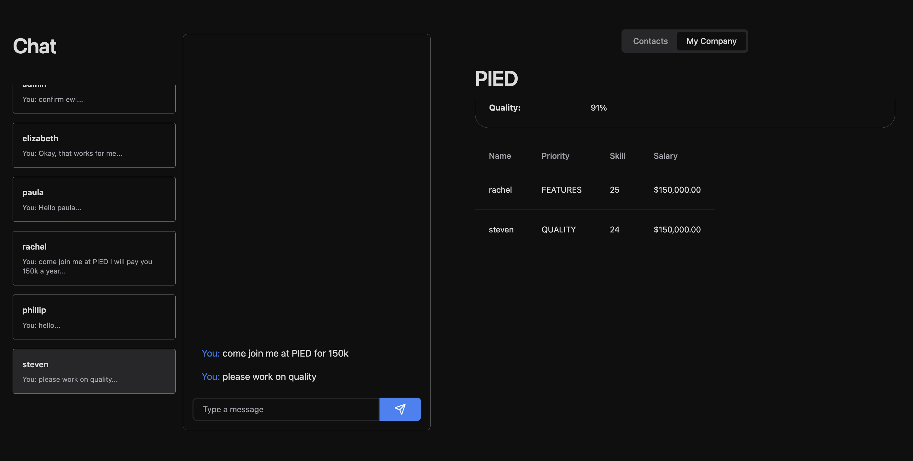
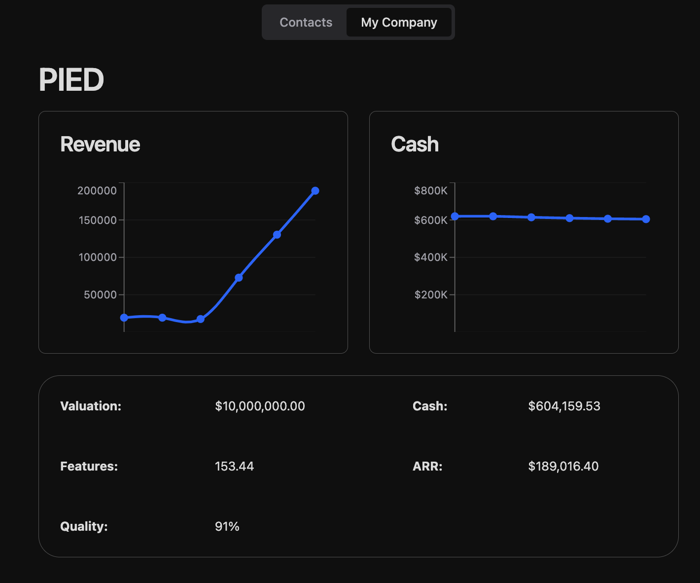

# Founder Mode: The Game

In this simulation-based game, you play the role of a startup founder trying to build the next billion-dollar unicorn. This guide will walk you through the basic setup and game mechanics.

## Installation

Make sure you have `docker` installed and an OpenAI API key saved in your environment variables under `OPENAI_API_KEY`

Then run

```
docker compose up -d --build
```

Once everything is up and running, the application should be availble at [http://localhost:5173](http://localhost:5173)

## Gameplay

The core mechanics of the game are quite simple:

- You convince VCs to give you money
- You use the money to hire engineers
- Engineers can either work on new features or technical debt ("quality")
- The more features you release, the more likely you are to land customers, and the higher your contract sizes will be
- Try to grow quickly and manage your burn so you can reach $100m in ARR

To get more specific about how the game works, there is a population of AI agents, some representing engineers and others representing VCs. The AI is helpful in this case to give a more natural dialog and sense of realism to the game

You communciate with agents via a chat interface. To start a new chat, click on the `New Chat` box and type `/[name] [your message]` to start a conversation with someone. This will pop the conversation into its own tab so you no longer need the `/[name]` prefix.

### Getting started

Before you start the game, go to the `Settings` tab and choose a name for your company, spaces are not allowed.

### Raising money

The first step in playing the game is to raise some funds so you can start hiring engineers. Use the table on the right to find an investor, then message them in the chat box. You must tell the investor three things: the name of your company, the amount you want to raise, and the post-money valuation. You might go back and forth a bit.



When the investor makes an investment, you will get a message from `admin` asking you to confirm the investment, respond with `confirm` and the one-time code and you'll get the money in the bank!



### Hiring engineers

Now that we have some money, it's time to hire an engineer so we can start shipping features. Every engineer has a randomly-generated "skill level", which you can roughly think of as the number of features they will release every game tick. Higher is, obviously, better.

To hire an engineer, message them saying you are offering them a job and include the salary and your company name.



Similar to accepting VC investment, you will get a confirmation message



Hooray! Our engineer is cranking out new features and you can watch the feature numbers tick up and also see our revenue graph skyrocket. This is because the game has a secret population of customers whose propensity to buy is proportional to the number of features they need. You can imagine there is a small contingent of "early adopters" who will buy even at lower feature counts, but if you ship features quickly, you start selling to more customers. Each feature is also worth some monetary value, so the more features you have, the higher your contracts!

Things seem to be going well, but soon there is trouble.



The problem is that over time, our tech debt added up and we started losing features. As you can see, our quality was only 50%, which means 50% of our features were breaking every week. Furthermore, the quality is also impacting customer churn.

To fix the problem, we need to hire another engineer to clean up technical debt. Let's hire one:


We can tell steven to focus on quality by messaging him



And now, our revenue graph looks much healthier. At 91% quality, we are thriving, but could do better if we hired more engineers. The question you have to ask is whether it's more important to prioritize new features or technical debt.



## Disclaimer

This game is purely a parody and should be viewed as such. It is not affiliated with, nor does it represent the views or opinions of the original creators or any affiliated parties. Any resemblance to real life people is purely coincidental.
